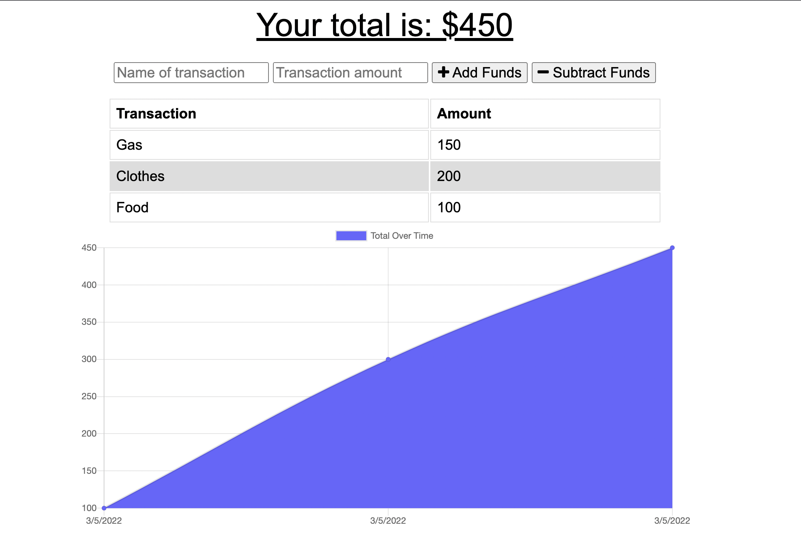

# Challenge: Budget-Trackinit

## Table of Contents
----------------------------------------------------------------
- ## [Description](#Description)
- ## [Installation](#Installation)
- ## [Usage](#usage)
- ## [Contributors](#Contributors)
- ## [License](#License)
-------------------------------------------------

## Description
AS AN avid traveler I WANT to be able to track my withdrawals and deposits with or without a data/internet connection SO THAT my account balance is accurate when I am traveling.  

## Installation
'npm init' to install dependencies: Mongodb, Express, mongoose

## Usage 
Budget tracker that works without internet connection, and updates user when an expense or deposit is added. When internet is reestablished the deposit or expenses will be added 

'npm start' to access app at localhost:3001 

Deployed app: https://budget-trackinit.herokuapp.com/

## Contributors
Bianca Chami

------------------------------
## License 

    
------------------------------------

## Preview

